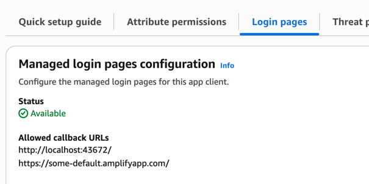

# team-cli
Command line interface for AWS TEAM.

### Install

Install command:

```bash
go install github.com/csnewman/team-cli/cmd/team-cli@latest
```

Configure remote server:
```
team-cli configure team.you-company.com
```

### Usage

List accounts:
```
$ team-cli list-accounts

Accounts:
  [1] id="123123123123" name="example"
    - role="ReadOnlyAccess" max_duration=8 requires_approval=false
```

### TEAM install configuration

The default cognito client app does not allow localhost redirects upon successful authentication. `team-cli` requires
it's callback address to be added to the allowed list to be able to fetch authentication tokens.

#### Via web UI:

Add `http://localhost:43672/` to the `team06dbb7fc_app_clientWeb` app client in the Cognito `team` user pool.


